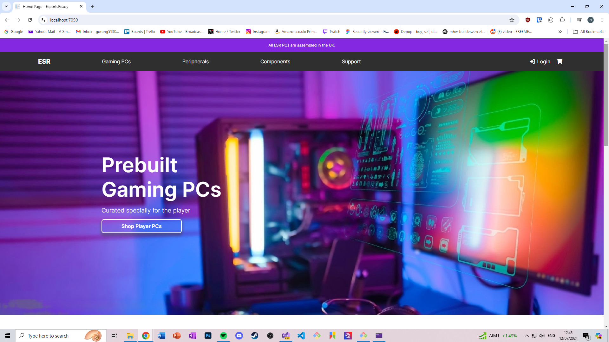
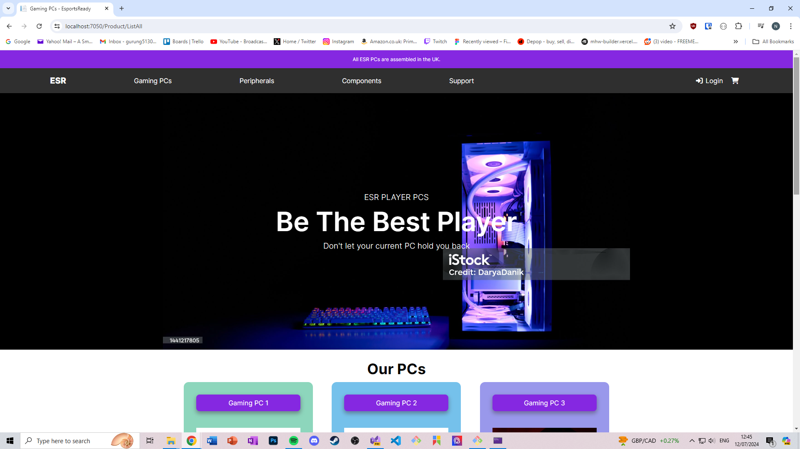
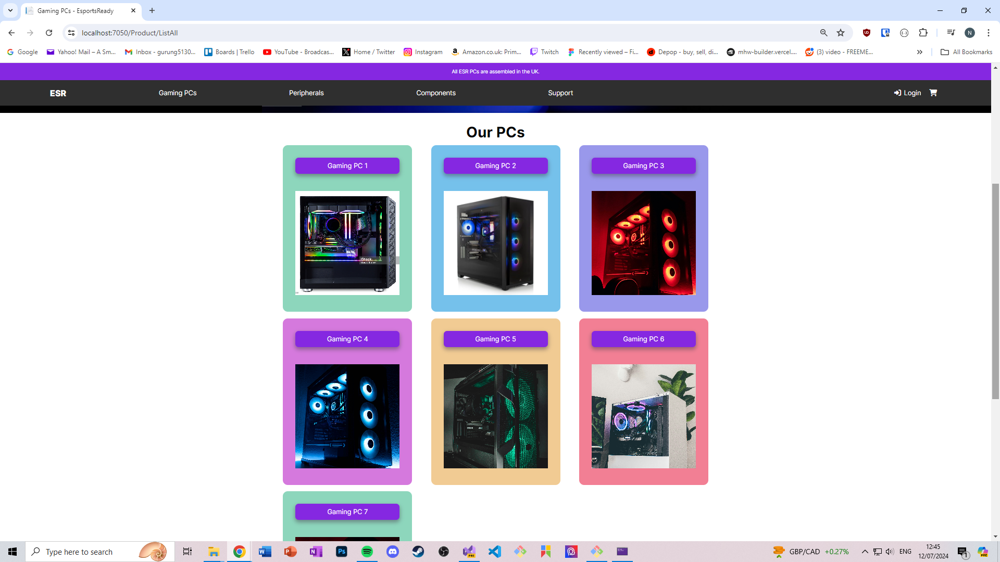
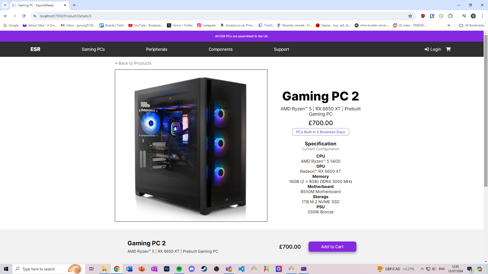
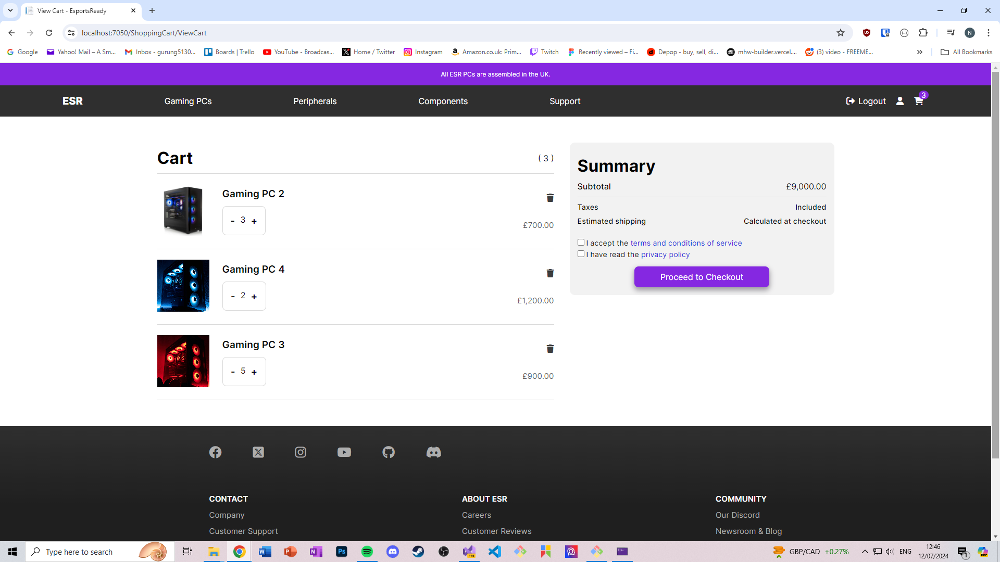
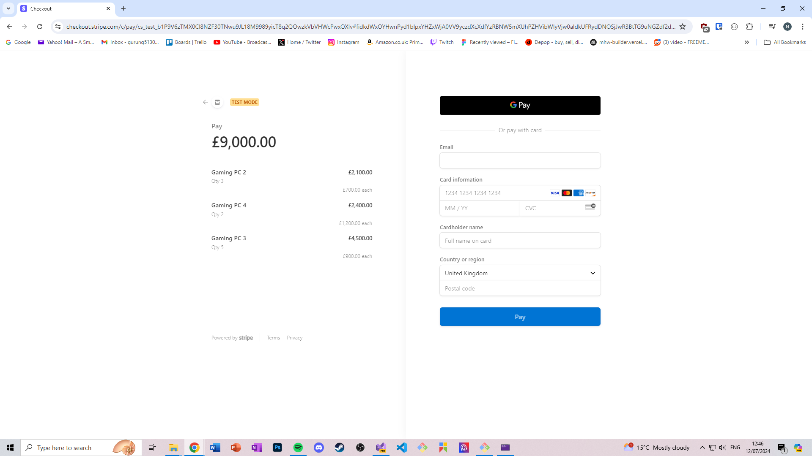
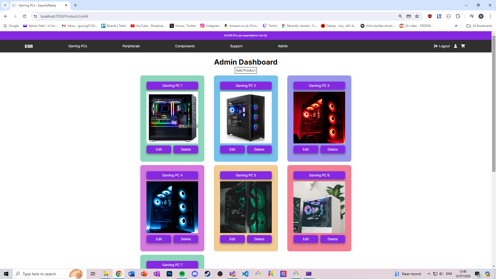
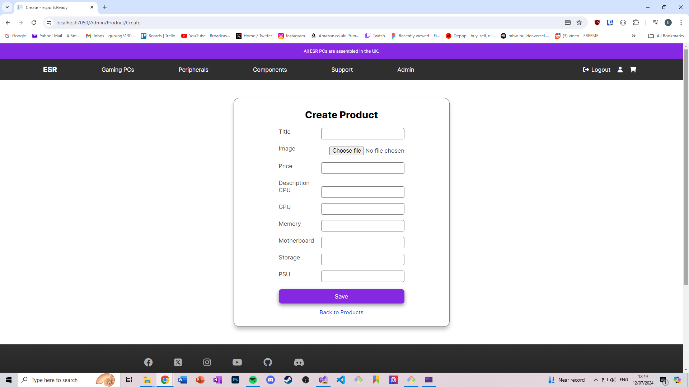
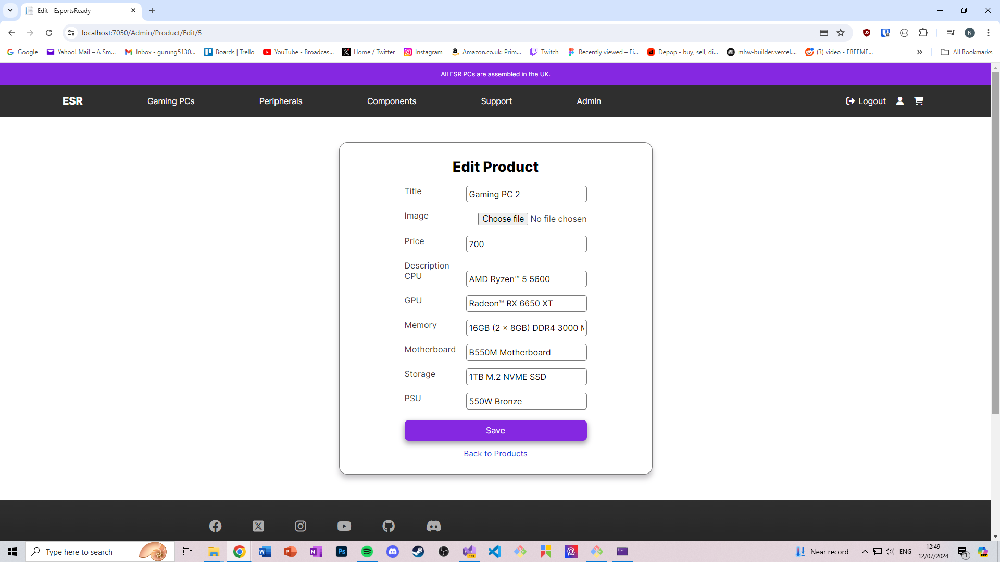
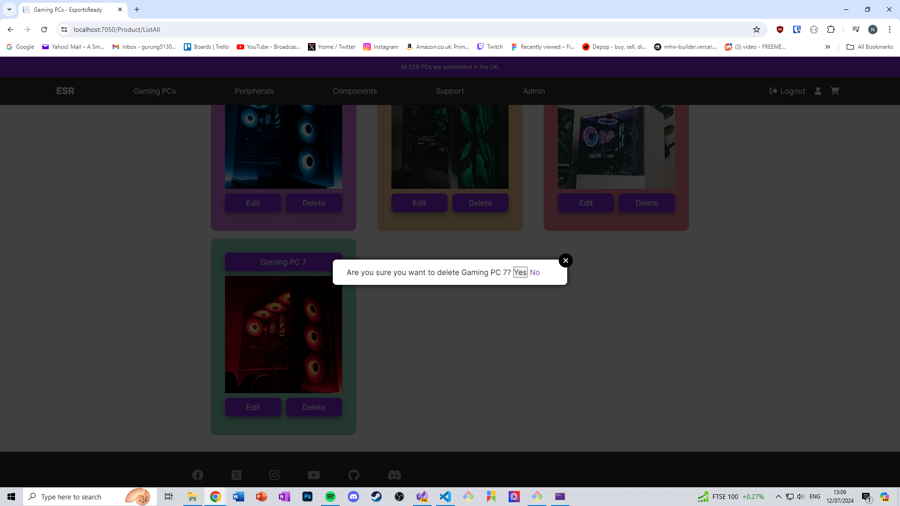

## Esports Ready (ESR)

### Fullstack E-Commerce Web App

Fully functioning e-commerce app that aims to sell custom prebuilt PCs for gamers.
Technologies used:

- ASP.NET CORE MVC
- EF Core
- SQL Server
- SendGrid
- Stripe

Functionalities include:

- Product browsing
- Login/Registration
- Role based authorisation (Admin/User)
- CRUD operations via Admin dashboard (Admin login route)
- Add to cart
- Checkout and purchase via Stripe checkout page

### Home page

### Product page

### Products

### Product details

### Add to cart

### Stripe checkout

### Admin dashboard

### Create

### Edit

### Delete

